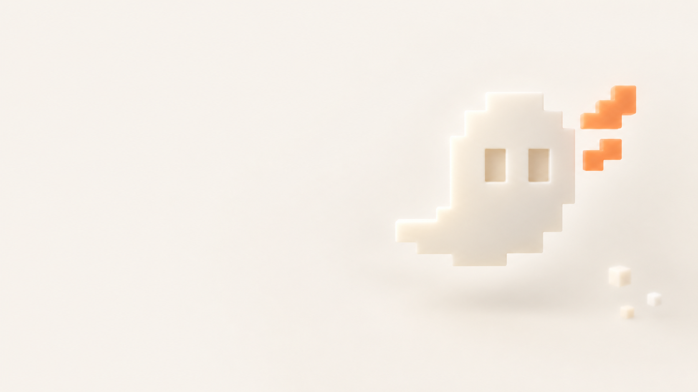
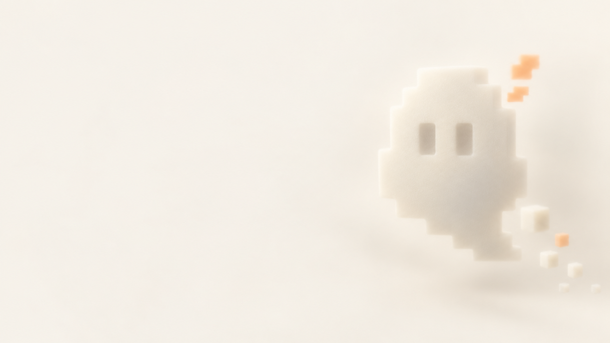

# Landing hero backgrounds

Created October 9, 2026 with the built-in ImageGen tool for David's landing-page exploration. These background illustrations complement the approved pixel ghost logo. Version 2 was refined after rendering the first version with the real project fonts, headline, copy and action button.

**For a visual overview, open the [preview gallery and agent handoff](../../output/landing-hero-study/README.md).** It includes light/dark desktop and mobile screenshots, plus instructions for opening the self-contained interactive comparison locally.

## Recommended pair: version 2

| Asset | Use |
| --- | --- |
| [Light background](ghost-background-light-v2.png) | Warm beige scene behind ink text. PNG, 1672 × 941. |
| [Dark background](ghost-background-dark-v2.png) | Matching warm dark scene behind cream text. PNG, 1672 × 941. |
| [Light edit prompt](ghost-background-light-v2.prompt.txt) | Exact ImageGen prompt; inputs were the original scene and approved logo preview. |
| [Dark edit prompt](ghost-background-dark-v2.prompt.txt) | Exact ImageGen prompt; input was the refined light scene. |
| [Interactive typography comparison](../../output/landing-hero-study/index.html) | Original / refined light / refined dark, with actual local fonts and a mobile layout. |
| [Light hero composition](../../output/landing-hero-study/hero-light.png) | Browser-rendered desktop preview, 1440 × 820. |
| [Dark hero composition](../../output/landing-hero-study/hero-dark.png) | Browser-rendered desktop preview, 1440 × 820. |
| [Light mobile preview](../../output/landing-hero-study/hero-light-mobile.png) | Browser-rendered composition at 390 px width. |
| [Dark mobile preview](../../output/landing-hero-study/hero-dark-mobile.png) | Browser-rendered composition at 390 px width. |

The refinement restores the logo's left-pointing tail and broader proportions, strengthens the stepped contour and orange wing, reduces the foam-like haze and removes excess floating blocks. The background remains softer than the live text. The two theme variants use matching compositions so the visual hierarchy stays consistent.

### Typography and theme handoff

- Headline: Geist Pixel Square 400, 72 / 80 px on desktop, normal tracking. At narrower widths the study uses 56 / 64 px, then 44 / 50 px on mobile.
- Copy: IBM Plex Mono 400, 16 / 26 px. Main button: IBM Plex Mono 600, 16 / 24 px.
- Light text: ink `#292622`, canvas `#F5F2EC`. Dark text: cream `#F5F2EC`, canvas `#211A16`.
- Main action: orange `#FF8A3D` with ink text in both themes.
- Keep text as real HTML. The images themselves contain no words or controls. The sample headline “An agent that learns your way.” and supporting copy are working copy, not approved final marketing text.
- On desktop the image occupies the hero behind the content, with a calm left text area and the ghost on the right. Use a subtle theme-colored edge fade to blend it into the page.
- On mobile move the artwork below the text and actions, as in the preview. Do not simply center-crop the desktop image behind the headline.
- Select the image and palette together before first paint. Keep any blur on the decorative layer only. The study sets `color-scheme: light` on the pale navigation-logo tile so the approved dark SVG stays legible within the dark page.

### Preview checks

The local browser loaded the actual Geist Pixel Square and IBM Plex Mono files. Light/dark switching and the original-image comparison were exercised. Desktop and 390 px mobile screenshots were inspected; the mobile document has no horizontal overflow at that width.

Measured minimum contrast across the rendered desktop headline/background region is 12.95:1 in light mode and 14.87:1 in dark mode. Supporting copy is at least 13.16:1 and 15.31:1 respectively; button text is 6.42:1 in both modes. These are checks of this specific composition, not a full accessibility audit or a guarantee for other crops and overlays. Details: [render checks](../../output/landing-hero-study/render-check.json), [contrast checks](../../output/landing-hero-study/contrast-check.json).

The preview is an image-and-typography study, not the final landing-page implementation. PNG assets and prompts are included in this directory. The interactive comparison includes its own font and token dependencies. Publishing this asset bundle does not deploy a website.

## Original exploration: version 1

- [Background image, PNG](ghost-background-v1.png)
- [Exact generation prompt](ghost-background-v1.prompt.txt)
- [Approved logo assets](../logo/README.md)

## Intended use

Use the empty left part for the headline and supporting copy. The ghost, orange wing and loose pixel blocks sit on the right. The image already contains a gentle blur; keep HTML text and controls sharp and outside any filtered element.

Keep the page background beige (`#F5F2EC`) and place the image on its own decorative layer. Blend the image into the page with a beige overlay or edge mask as needed; generated edge colors are approximate. Use the actual Geist Pixel Square and IBM Plex Mono fonts for all page text.

A suggested scroll treatment is to keep this background behind the opening section, then reveal one short explanation at a time using opacity and a small vertical offset. A progressively stronger beige overlay can quiet the image behind later content. Ensure information remains available without animation and respect reduced-motion preferences.

The desktop composition has an empty left area. A narrow mobile crop needs separate review: avoid moving the ghost behind the headline. Use a softer, more strongly veiled background on mobile if necessary.

Keep the approved sharp SVG logo in navigation separate from this decorative illustration. The image contains no product name or marketing copy. No final landing-page implementation or deployment is included.
