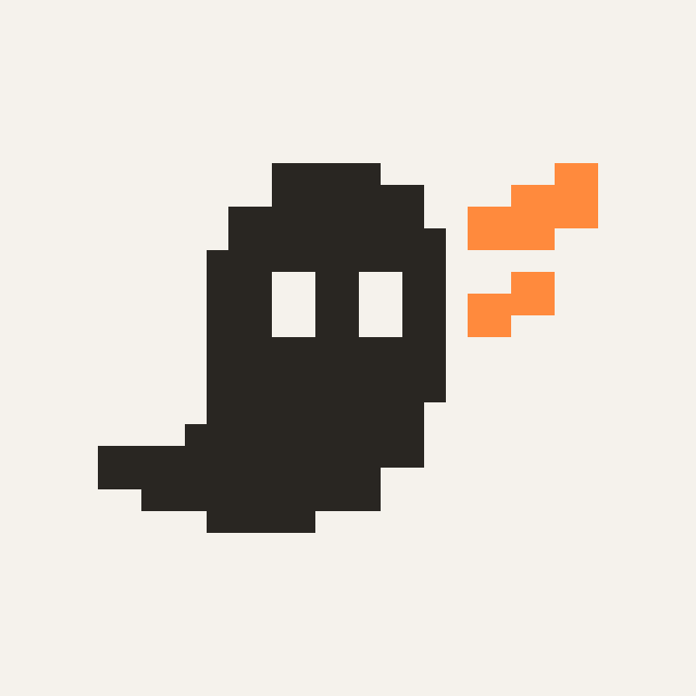

# Wisp pixel ghost logo

Approved by David on October 9, 2026. This is the selected standalone mark: an ink pixel ghost with an orange wing, with no name or wordmark. The product name is **Wisp**, confirmed by David on October 9, 2026.



## Assets

| File | Use |
| --- | --- |
| [pixel-ghost.svg](pixel-ghost.svg) | Master vector for the application. Transparent background, 24 × 24 viewBox, no font dependencies. |
| [pixel-ghost.png](pixel-ghost.png) | Transparent 768 × 768 PNG for importing into other tools. Includes padding around the mark. |
| [pixel-ghost-preview.png](pixel-ghost-preview.png) | 768 × 768 preview on the project beige background. |

Use the SVG in the application at 24, 48 or 72 px. Preserve its aspect ratio, stepped edges, eye cutouts, tail and orange wing. Use the approved colors: ink `#292622` and orange `#FF8A3D`, on white or beige `#F5F2EC` surfaces.

## Application use

The current local server maps the project's `design` directory to `/design/`. For that server:

```html

```

Use `alt=""` when an adjacent accessible application name already identifies the brand. If another build system uses a public assets folder, copy the master SVG there and adjust the URL.

The mark follows the pixel geometry of Geist Pixel Square and the project icon system. It is original SVG artwork drawn in this project, not an asset from the Nucleo icon package. No fonts, scripts, remote resources or external images are embedded. The approved outline and colors are preserved from the selected logo exploration.
