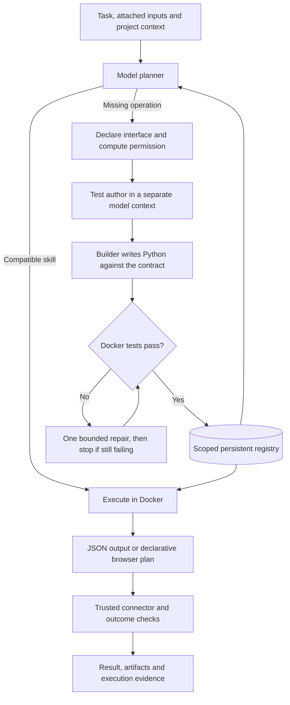

# Architecture and execution boundaries

Wisp is a local Python application with an HTML/CSS/JavaScript UI, SQLite persistence, a Docker execution sandbox, and fixed browser/native connectors. It uses an explicitly selected Gemini or ChatGPT provider. It does not fine-tune model weights or let generated skills rewrite the controller.

## From a task to a reusable skill

The test author sees the task and sanitized manifest, not candidate code. The builder receives the contract and its test examples. A candidate that fails gets at most one automatic repair before the run fails. This separation reduces one source of circular testing; the test author can still misunderstand a contract.

A capability defines `run(data)` with JSON input/output schemas, a title, description, kind and `permissions: ["compute"]`. Kinds are `task`, `browser_plan` and `discovery`. The registry retains code, code hash, version, cases, results and provenance. Installation follows passing tests. Model-authored cases use deterministic expected outputs; browser-plan cases also use a fixed semantic comparator.

**Improve** is a separate correction path: a new case must first fail the old implementation. Two repairs are tested against the combined old/new cases. The first passing candidate becomes a new version; otherwise the previous active version remains. A failure while merely using an installed skill stops the task; it is not an unbounded automatic repair loop.

## PATCH and BLACKOUT execution path

PATCH renders forms from active tested compute contracts. [`local_actions.py`](../workbench/local_actions.py) checks project scope, active version, code fingerprint, complete passing test report and input schema before execution, then rechecks the record before running code in Docker. Unsupported fields are rejected. It saves a result artifact and execution evidence without reaching the planner or provider. Browser-plan and discovery skills are excluded.

BLACKOUT persists `ai_paused` in SQLite. The normal task entry point rejects requests before provider readiness checks; corrections and schedules use that same gate. The switch cannot change during an active task. Saved action execution remains available and records zero model calls; the switch does not disable networking or remove earlier learning costs.

[`action_app.py`](../workbench/action_app.py) is a fixed, explicitly invoked Fieldwork adapter. It binds current application inputs to a revision/hash when loaded, rejects stale previews, inactive versions and changed artifacts, and independently checks the applied allocation including group integrity. Replacing the roster clears existing assignments; the UI names that effect. An uncertain apply is marked for review and cannot be blindly retried from the same preview. Generated code retains compute-only permission.

## Team-written infrastructure versus agent-generated work

| Component | Origin and role |
| --- | --- |
| [`engine.py`](../workbench/engine.py), provider adapters | Team-written planning, creation, test gate, correction, logging and budgets |
| [`store.py`](../workbench/store.py) | Team-written SQLite registry, versions, projects, conversations and application memory |
| [`sandbox.py`](../workbench/sandbox.py) | Team-written isolated execution boundary |
| [`browser_control.py`](../workbench/browser_control.py), [`driver.cjs`](../workbench/browser/driver.cjs) | Team-written browser permissions, observations and actions |
| [`event_validation.py`](../workbench/event_validation.py), Fieldwork app | Team-written showcase and constraint checks |
| [`catalog.py`](../workbench/catalog.py) | Team-written discovery-plugin interface and metadata validation; not proof of agent-created discovery |
| [Published generated skills](operations-evidence-2026-10-09/generated-skills.json) | Live-model CSV normalization, allocation and replanning, each with four passing recorded cases |
| [`tests/`](../tests/) | Handwritten infrastructure fixtures and regressions; not competition evidence of generated capabilities |

The optional discovery plugin computes an index and matches over registry records in Docker. The host checks IDs, versions, eligibility and required input fields before accepting results. It cannot authorize installation or change permissions. The [final evidence](frankenstein-final-evidence-2026-10-09/) records actual agent creation with seven passing tests and execution in both learning and a separate reuse process. Raw registry inspection remains available to the planner.

## Where code executes

Generated Python runs in a fresh container with no network, no workspace mount, no provider credentials, a read-only root, non-root UID, dropped Linux capabilities and `no-new-privileges`. It has a 128 MB memory limit, 0.5 CPU allocation, 32-process limit, bounded temporary storage and an eight-second default wall timeout. Combined stdout/stderr is capped at 64,000 bytes; code at 60,000 characters and the serialized input packet at 180,000 bytes.

Generated code is intended for pure standard-library computations. Docker provides the isolation boundary; this is not a Python language-level proof that all filesystem or subprocess APIs are impossible. The isolated container's own resources remain distinct from the host. This prototype has not undergone a security certification or adversarial sandbox audit.

A generated `browser_plan` computes JSON in Docker. Trusted host code validates and executes that plan against fresh observed controls. It does not evaluate generated JavaScript or Python on the host. The fixed connector, not the skill, owns browser authority.

## Permissions and operator control

- Skill manifests must request exactly `compute`; broader manifests are rejected.
- A task records its chosen application and explicitly attached file IDs. Later tasks may have different user-supplied files; that is not a skill granting itself authority.
- Browser control is limited to one connected origin. Redirects and WebSockets are blocked. External mutations require operator approval; local synthetic fixtures are the declared exception.
- Native control is limited to one selected macOS application and always reviews mutations. Accessibility permission must be granted by the user; actual native interaction remains unverified.
- Files are resolved through the vault, with task-scoped IDs. A skill cannot select arbitrary host paths for upload.
- **Stop task** stops subsequent operations; it is not rollback of external actions. Deactivation and version selection control future skill use.

Fieldwork's outcome adapter checks roster fidelity, complete attendee accounting, preference/capacity constraints and an applied allocation. The later room-change evidence also checks preservation of unaffected seats against captured state. These checks do not establish optimal allocation or arbitrary natural-language correctness. Other sites and native apps finish as `needs_review` unless the operator confirms the observed result. Human confirmation is logged separately.

## Runtime and cost bounds

| Setting / mechanism | Shipped default | Code ceiling / behavior |
| --- | ---: | --- |
| `MAX_MODEL_CALLS` | 18 | 20; failed requests count |
| `MAX_RUN_SECONDS` | 240 | 600 seconds; checked throughout the loop and passed to bounded operations |
| `MAX_OUTPUT_TOKENS` | 8192 | 8192 for Gemini; not sent by the ChatGPT adapter |
| `MAX_RUN_USD` / `SPEND_POLICY` | `0` / `strict` | Pre-inference monetary admission; unknown-price routes blocked |
| New-skill repair | One | Failed second candidate stops installation |
| Malformed model JSON | One retry per run | Same selected model, within the original budget |
| Repeated identical pure computation | One cached reuse | Further repetition stops the run |
| Provider quota/transport error | No automatic retry/fallback | Run stops |

The recorded long showcase used 20 calls / 600 seconds and predates the monetary gate. [`spend.py`](../workbench/spend.py) now checks each request before inference. The default strict policy has a $0 per-run cap and admits only an allowlisted Gemini model with operator-confirmed Free-tier status. Unknown-price routes are rejected. Decimal reservations cannot exceed the cap; failed requests retain reservations instead of assuming zero consumption. Infrastructure tests cover these boundaries. Final run `bf47b3caa23b48cea2f7383f875976e5` used three Gemini Free calls under this strict gate. Its source capabilities came from the earlier ChatGPT learning process, which did not have the gate; do not retroactively label that learning run financially capped.

This is conditional on billing remaining disabled: Wisp cannot inspect Google billing or force a free-only request. The optional `SPEND_POLICY=existing_plan` permits ChatGPT plan inference but explicitly has **no local USD guarantee**; it is not a strict-cap path. The official [SIWC preview limitations](https://developers.openai.com/siwc/token-sharing-open-source/preview-limitations) reject `max_output_tokens`, and no per-request USD ceiling is available. Existing-plan costs remain unknown, not zero. There is no automatic paid fallback. UI/API expose the policy separately from usage estimates and preserve each run’s admission record.

## Data and credentials

The server listens on `127.0.0.1` and checks Host/Origin on local requests. It is intended for a personal machine, not a multi-user or publicly exposed deployment.

- `.env`: local provider configuration and Gemini key, ignored by Git.
- `.runtime/`: SQLite state, tasks, code, tests, application maps, attached/generated files and schedules, ignored by Git.
- `~/.config/007-frankenstein/accounts.json`: local ChatGPT credentials outside the repository, written with private file permissions.
- Provider requests: task text, relevant project/conversation context, readable attachments, registry metadata and application observations. Local storage does not mean fully offline inference.

New chats clear conversation context, while the project's persistent registry remains. Up to six recent turns can be included within the same chat; omitted oversized context is identified. Projects scope ordinary use but are not separate OS/security tenants. Saving conflicting workspace changes is rejected and the UI offers recovery/export.

Schedules persist in SQLite and dispatch through the same engine, budget and connector boundaries. The server must be awake; missed intervals dispatch once, busy runs defer dispatch, and dispatch errors pause the schedule.

## What is not implemented

No team sharing, multi-origin sessions, external MCP service integration, universal desktop control, hosted always-on service, automatic wake agent or general offline natural-language planning. There is no universal cross-provider dollar cap or programmatic billing verification; unpriced routes are blocked in strict mode. There is no completed accessibility audit, controlled productivity benchmark or proven customer demand. See the [jury guide](jury-guide.md) for the exact evidence boundary.
