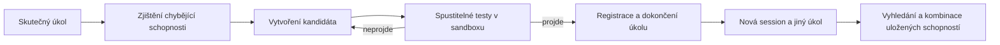

# Self-extending AI agents: kritická rešerše pro Frankenstein sólo

**Stav: 8. října 2026.** Podklad k rozhodnutí, nikoli schválené produktové zadání. Soutěžní požadavky vycházejí z [ověřeného briefu](hackathon-brief.md); interpretace a návrhy níže jsou naše.

## 1. Co z rešerše plyne

**Samotné „agent se učí z práce a vytváří si skills“ už není přesvědčivá odlišnost.** Existují provozované nástroje, veřejné implementace i výzkumné systémy pokrývající značnou část tohoto mechanismu. Nejbližší Davidovu směru jsou Hermes a AutoSkill; pro pochopení testované evoluce EvoSkill; pro celý životní cyklus MUSE-Autoskill. Přímé zdroje a rozdíly jsou v následujících tabulkách.

**To neznamená, že problém je vyřešený.** Důležitá otázka je, zda uložená zkušenost zlepší příští odlišný úkol, kolik stojí její získání a údržba a zda uživatel potřebuje méně zásahů. Knihovna plná souborů není důkaz učení ani užitečnosti.

Pro náš projekt bych nyní:

1. **Vyřadil obecný pitch „AI agent, který se sám zlepšuje“.** Neříká, komu pomáhá, a překryv s existujícími řešeními je příliš velký.
2. **Nejdřív ověřoval konkrétní opakovanou chybu nebo nutnost opakovaného vysvětlování.** Učení má odstranit tuto práci, ne pouze vytvářet další dokumentaci.
3. **Použil existující základ tam, kde pomůže**, ale vlastní přínos formuloval jako pozorovatelnou změnu chování na nových úkolech. Sandbox, registr nebo hezký přehled samy o sobě odlišnost neprokazují.
4. **Oddělil produktovou vizi od nočního dema.** Širší vize může být agent, který si osvojuje pravidla práce s produktem. První demo musí mít jednoho uživatele, měřitelný výsledek a celý povinný průchod.

### Jak silné jsou závěry

- Čtené podklady: původní papers, oficiální dokumentace a repozitáře, vybrané zdrojové soubory, veřejná hlášení uživatelů.
- U čtyř implementací je níže uvedena konkrétní revize a statická kontrola důležitých cest. Nebyl proveden úplný audit repozitářů.
- **Žádný z těchto agentů nebyl v této rešerši nainstalován ani spuštěn. Benchmarky nebyly reprodukovány.** Výsledky studií jsou výsledky uváděné autory.
- Reddit a issues dokazují existenci jednotlivých zkušeností, nikoli četnost problému, velikost trhu nebo stav všech současných instalací.
- Jde o cílenou rešerši pro rozhodnutí během hackathonu, nikoli systematický přehled celé literatury. Nepřítomnost funkce v přečteném souboru není důkaz její nepřítomnosti v celém ekosystému.

## 2. Co přesně znamená „self-extending“

Pro tuto práci používáme následující rozlišení:

| Mechanismus | Co se mění | Co ještě neprokazuje |
| --- | --- | --- |
| Paměť faktů a preferencí | Uložené informace o uživateli či projektu | Vznik nové vykonatelné schopnosti |
| Procedurální paměť | Postup, pravidla, příklady a podmínky použití | Že postup funguje mimo původní situaci |
| Tvorba nástroje za běhu | Nový kód s rozhraním, který agent následně používá | Správnost, bezpečné spuštění a pozdější reuse |
| Evoluce knihovny schopností | Tvorba, testování, výběr, opravy, slučování a vyřazování | Automatické zlepšení každou iterací |
| Úprava samotného agenta | Plánovač, prompt, tool descriptions nebo řídicí kód | Změnu inteligence základního modelu |
| Trénování modelu | Váhy modelu | Splnění našeho tracku; fine-tuning je mimo zadání |

**Nemusí to být druhý agent stavějící prvního agenta.** Jeden systém může používat stále stejný model a rozšiřovat si vnější knihovnu nástrojů. Výsledek se může zlepšovat, přestože se modelové váhy vůbec nemění. Tento princip je dobře patrný už u [Voyageru](https://voyager.minedojo.org/).

Agent Skills je formát balíčku: povinné jsou `SKILL.md`, jméno a popis; skripty a další soubory jsou volitelné. `allowed-tools` je experimentální pole. **Z existence SKILL.md nelze vyvodit, že proběhly testy nebo že byla oprávnění vynucena sandboxem.** To musí řešit runtime. [Specifikace Agent Skills](https://agentskills.io/specification).

Pro Frankensteina potřebujeme přibližně tento průchod:

Discovery a správa schopností se musí také rozvíjet prací agenta. Oprávnění, rozpočet a kontrola instalace zůstávají pod kontrolou pevné infrastruktury. Graf je naše zjednodušení [briefu](hackathon-brief.md), ne univerzální architektura všech zkoumaných systémů.

## 3. Mapa nejrelevantnějších řešení

„Zajímavý základ“ znamená kandidáta k ověření, nikoli doporučení k okamžité instalaci.

| Projekt | Co vzniká nebo se mění | Jaká je zpětná vazba | Význam pro nás |
| --- | --- | --- | --- |
| **[Hermes Agent](https://hermes-agent.nousresearch.com/docs/user-guide/features/skills)** | Procedurální skills ze zkušeností a oprav uživatele; přetrvávají mezi sessions | Zkušenosti z úkolů, background review, nástroje správy | Nejdřív porovnat s ním. Velmi blízký obecnému osobnímu učícímu se agentovi |
| **[AutoSkill](https://arxiv.org/abs/2603.01145)** | Skills extrahované z dialogů a trajektorií, jejich další úpravy a reuse | Interakce s uživatelem a následné požadavky | Nejbližší nápadu „učí se při spolupráci se mnou“ |
| **[AutoSkill / SkillEvo](https://github.com/ECNU-ICALK/AutoSkill/blob/main/SkillEvo/README.md)** | Mutované verze existujícího skillu a lokální vítězná varianta | Replay, hodnoticí pravidla, oddělená data pro výběr | Už řeší část „ověř skill před povýšením“ |
| **[EvoSkill](https://arxiv.org/html/2603.02766v1)** | Nové a upravené skill folders | Analýza selhání, validace a výběr kandidátů | Silná metodická inspirace pro měřitelné zlepšování |
| **[MUSE-Autoskill](https://arxiv.org/html/2605.27366v2)** | Skills, jejich paměť, katalog a úpravy | Testy tam, kde jsou součástí balíčku; jinak slabší runtime kontroly | Velký překryv s celým životním cyklem Frankensteina; zde ověřen paper, nikoli oficiální běžící implementace |
| **[DynaSaur](https://arxiv.org/abs/2411.01747)** | Python akce, které lze vytvářet, skládat a akumulovat | Výsledek vykonání a další řešení úkolu | Srozumitelný příklad skutečného rozšiřování toolsetu; významné limity převzetí kódu níže |
| **[Voyager](https://voyager.minedojo.org/)** | Knihovna vykonatelných dovedností v Minecraftu | Prostředí, chyby při vykonávání, self-verification | Důkaz, že tento základní princip existuje už od roku 2023; specializované prostředí |
| **[Agent Workflow Memory](https://arxiv.org/abs/2409.07429)** | Opakovaně použitelné pracovní postupy z předchozích trajektorií | Offline i online zkušenosti z webových úkolů | Blízké učení webových workflow; samo o sobě není celý instalační a testovací systém |
| **[OpenAdapt](https://openadapt.ai/how-it-works)** | Program odvozený z ukázky GUI workflow | Lidské přijetí programu, následné ověření skutečného efektu | Přímé srovnání pro „ukaž mi práci a příště ji zopakuju“ |
| **[Hermes Agent Self-Evolution](https://github.com/NousResearch/hermes-agent-self-evolution)** | V implementované fázi optimalizace skill textu | Evoluční hledání nad daty a skórováním | Zajímavý doplněk, ale README a kontrolovaná cesta kódu se v síle záruk rozcházejí |
| **[Darwin Gödel Machine](https://sakana.ai/dgm/)** | Vlastní kód agenta a archiv jeho variant | Vykonávané programátorské benchmarky | Výzkum evoluce agenta; pro dnešní sólo implementaci zbytečně široký cíl |

Další důležitá komponenta je **SkillComposer**: řeší společně výběr schopností, jejich počet a pořadí. Jeho publikovaná metoda využívá trénovanou predikci sekvencí skills; její trénink není náš noční plán. Poučení je užitečné: najít několik podobných skills ještě neznamená sestavit fungující postup. [Generative Skill Composition for LLM Agents](https://arxiv.org/abs/2606.32025).

## 4. Co výzkum skutečně dokládá

### Pouhé napsání instrukcí není spolehlivá cesta ke zlepšení

SkillsBench uvádí průměrné zlepšení s kurátorovanými skills o **16,2 procentního bodu**, ale s automaticky vytvořenými skills přibližně **−1,3 bodu** proti příslušným baseline konfiguracím. Zásadní detail: v této podmínce agent píše postup **před řešením úkolu**. Nejde o totéž jako opakované učení ze skutečných selhání a měření přenosu. Studie proto nevyvrací všechny formy self-extension. Verze v1 navíc uvádí v abstraktu 86 úkolů, zatímco vyhodnocení používá 84; pro interpretaci je rozhodující metodika a tabulka 3. [SkillsBench, §3.3–4.1](https://arxiv.org/html/2602.12670v1).

### Externí zpětná vazba a výběr kandidátů dávají lepší důvod k optimismu

EvoSkill rozděluje práci mezi vykonavatele, návrháře změn a tvůrce skillu. Kandidáty vybírá podle validačního výsledku a drží oddělený závěrečný test. Autoři uvádějí na SealQA posun **26,6 → 38,7 %** a přenos jednoho skillu na BrowseComp **43,5 → 48,8 %**. To je relevantnější pro nové úkoly než zopakování původního vstupu. Zároveň autoři uvádějí jediný běh konfigurací kvůli ceně a omezené ověření variability. Nejde o záruku stejného zisku v našem produktu. [EvoSkill, §2–3](https://arxiv.org/html/2603.02766v1).

### Pozor na působivá čísla z vybrané části úkolů

MUSE uvádí **85,24 %** pro úkoly, u kterých vznikl použitelný skill. Pro všech 75 vyhodnocovaných úkolů činí výsledek **53,42 %**, baseline bez skills **46,95 %** a lidské skills **59,67 %**. Generování pokrylo 47 z 75 úkolů. Navíc se skill získává z trajektorie a znovu hodnotí na stejném úkolu; přenos do jiného agenta není totéž jako přenos na jiný problém. To oslabuje široké tvrzení „agent se obecně naučil novou schopnost“, nikoli hodnotu celé práce. [MUSE, §4.3 a Limitations](https://arxiv.org/html/2605.27366v2).

### Více evolučních kol neznamená průběžný růst

Studie *Rethinking Self-Evolving Agent Skills* porovnává různé typy feedbacku za stejných podmínek. Z 388 kandidátů bylo pouze **55** nových nejlepších variant podle validace. Vybraná evoluce zlepšila závěrečný test v 9 ze 14 nastavení; výsledky robustnosti a přenosu se někdy rozcházejí. Praktické poučení: potřebujeme možnost kandidáta odmítnout, zachovat starou verzi a skončit. Tvrzení „každým taskem chytřejší“ bych bez měření nepoužíval. [Paper a protokol](https://arxiv.org/html/2608.02636v1).

### I relevantní skill může škodit

*Agent Skills Can Be Harmful* analyzuje 307 případů funkčního zhoršení nebo zvýšených nákladů. Chyby nemusí způsobit očividně nesouvisející skill; i zdánlivě vhodný postup může zavést špatné předpoklady či přehnaně složitý proces. Jde o analyzované případy, ne tvrzení, že takové procento všech skills škodí. Vedle správnosti tedy musíme měřit také náklady a zbytečné kroky. [Abstrakt studie](https://arxiv.org/abs/2608.11888).

**Naše syntéza:** užitečné učení vyžaduje informaci navíc — výsledek akce, chybu, ověřené pravidlo či korekci — a kontrolu, zda z ní vzniklo přenositelné zlepšení. Nestačí požádat model, aby své původní domněnky přepsal do souboru.

## 5. Co bylo nalezeno přímo v implementacích

Níže jsou statická zjištění z konkrétních revizí. Nejde o výsledky spuštěných testů ani úplné bezpečnostní audity.

### Hermes: schopný základ, ale testovací bránu musíme doložit

Revize `d94b70f675205c2c046138997819428772cd2678`.

V `skill_manager_tool.py` jsou operace tvorby a změn, kontroly názvu, frontmatter a velikosti, zápisové schvalování, lint a záznam změn. Bezpečnostní sken agentem vytvořených skills je zde volitelný; výchozí hodnota `guard_agent_created` je `False`. V kontrolované cestě `_create_skill → _guarded_write` není povinné vykonání funkčních testů generované schopnosti. **Schválení zápisu, syntaktická kontrola a test použitelnosti jsou různé věci.** [Kontrolovaný soubor](https://github.com/NousResearch/hermes-agent/blob/d94b70f675205c2c046138997819428772cd2678/tools/skill_manager_tool.py).

Hermes už má **Curator**: sleduje používání, archivuje dlouho nepoužívané skills a volitelně je slučuje. Dokumentace uvádí obnovitelné archivy, pinning a rollback. Přidání pouhé deduplikace nebo historie tedy nelze prezentovat jako objevenou mezeru. [Curator](https://hermes-agent.nousresearch.com/docs/user-guide/features/curator).

**Verdikt:** vhodný první srovnávací základ pro osobního agenta. Fork celé aplikace nemusí být nejrychlejší cesta. Nejdřív je třeba určit minimální změnu a ověřit, zda zasahuje do skutečné potřeby uživatele. Licence hlavního repozitáře je [MIT](https://github.com/NousResearch/hermes-agent/blob/d94b70f675205c2c046138997819428772cd2678/LICENSE).

### AutoSkill / SkillEvo: přímý překryv s učením z člověka

Revize `94c47ca488d4ba4117d20272e66d49b9877e68cf`.

AutoSkill extrahuje skills z dialogů a agentních trajektorií, aktualizuje je a používá pro budoucí požadavky. Samotné „pamatuje si moje opravy a vytváří SKILL.md“ proto není novinka. [Původní práce](https://arxiv.org/abs/2603.01145), [repozitář](https://github.com/ECNU-ICALK/AutoSkill).

V `SkillEvo/runner.py` je rozdělení na `mutate_dev` a `promotion_test`. `_should_promote` požaduje dostatek výsledků, zlepšení skóre o nastavenou hranici a nezvýšení počtu tvrdých selhání. Nedostatek replay dat vede do stavu `incubating`; výstupy a hodnocení se ukládají. To už je konkrétní mechanismus výběru. Hodnocení kombinuje programová pravidla a LLM posuzování; není ekvivalentem libovolných integračních testů. [Runner](https://github.com/ECNU-ICALK/AutoSkill/blob/94c47ca488d4ba4117d20272e66d49b9877e68cf/SkillEvo/runner.py), [evaluátor](https://github.com/ECNU-ICALK/AutoSkill/blob/94c47ca488d4ba4117d20272e66d49b9877e68cf/SkillEvo/evals.py).

README výslovně uvádí, že zatím chybí automatický zápis vítěze zpět do hlavního SkillBank a retrieval-only evaluace. **Offline vybraná varianta proto ještě neznamená kompletní samočinný provozní cyklus.** [SkillEvo README](https://github.com/ECNU-ICALK/AutoSkill/blob/94c47ca488d4ba4117d20272e66d49b9877e68cf/SkillEvo/README.md).

**Verdikt:** velmi dobrá inspirace pro feedback a replay, přímý konkurent obecné myšlenky. Repo má MIT badge, ale při kontrole kořene nebyl nalezen samostatný licenční soubor pro celé jádro; licenční soubory uvnitř přibalených skills nevyřeší licenci každé části. Před převzetím kódu tento bod doověřit. Zde nic nepřebíráme ani neinstalujeme.

### Hermes Self-Evolution: nestačí věřit diagramu v README

Revize `0a929e3aa20e15cf04dc7c28492a7d41a5139125`.

README představuje širší plán, ale jako implementovanou označuje pouze evoluci skill souborů; evoluce popisů nástrojů, systémových promptů, kódu a kontinuální pipeline jsou plánované. Tvrzení o všech těchto funkcích by bylo přehnané. [README](https://github.com/NousResearch/hermes-agent-self-evolution/blob/0a929e3aa20e15cf04dc7c28492a7d41a5139125/README.md).

Dva zásadní nálezy:

- `fitness.py` má plný LLM judge, ale funkce **`skill_fitness_metric` používaná optimalizátorem hodnotí překryv slov s očekávaným chováním**. Zlepšené skóre proto samo neprokazuje, že agent provedl správné akce. [Fitness](https://github.com/NousResearch/hermes-agent-self-evolution/blob/0a929e3aa20e15cf04dc7c28492a7d41a5139125/evolution/core/fitness.py).
- `constraints.py` definuje `run_test_suite`, ale statická kontrola `evolve_skill.py` nenašla jeho volání. Přepínač `--run-tests` se předává do konfigurace; kontrolovaná cesta volá `validate_all`, která provádí velikostní a strukturální kontroly. **Povinné spuštění celé testovací sady pro tuto cestu není doloženo kódem**, přestože README tuto bránu popisuje. [Entry point](https://github.com/NousResearch/hermes-agent-self-evolution/blob/0a929e3aa20e15cf04dc7c28492a7d41a5139125/evolution/skills/evolve_skill.py), [constraints](https://github.com/NousResearch/hermes-agent-self-evolution/blob/0a929e3aa20e15cf04dc7c28492a7d41a5139125/evolution/core/constraints.py).

**Verdikt:** nebral bych jako hotový důkaz kvalitní evoluce pro naše demo. Je to kandidát ke zlepšení evaluace, ale oprava interního nástroje ještě neřeší uživatelskou hodnotu produktu. Kontrola byla statická; nebyla ověřena kompatibilita jeho závislostí spuštěním.

### DynaSaur: skutečně vytváří nástroje, ale výchozí běh není naše cílová izolace

Revize `b724fd697e5005872612c9c48bc5e649b4226a3b`.

V `agents.py` po vykonání kódu bez chyby následuje ukládání vygenerovaných funkcí; `save_generated_tools` zapisuje Python soubory a přidává je do vyhledávání. To je doložitelná akumulace schopností. V této cestě ale úspěšné vykonání bloku není samostatná sada testů přenositelnosti či správnosti. [Agent](https://github.com/adobe-research/dynasaur/blob/b724fd697e5005872612c9c48bc5e649b4226a3b/agents.py).

`actions.py` používá přetrvávající Chroma index s popisy nástrojů. `env.py` spouští lokální Jupyter kernel a vytváří jeho prostředí z `os.environ.copy()`. **Samotný tento runtime neodděluje generovaný kód od oprávnění a proměnných hostitele.** Nasazení uvnitř správně omezeného externího sandboxu by situaci změnilo; to zde nebylo zkoušeno. [Retrieval](https://github.com/adobe-research/dynasaur/blob/b724fd697e5005872612c9c48bc5e649b4226a3b/actions.py), [prostředí](https://github.com/adobe-research/dynasaur/blob/b724fd697e5005872612c9c48bc5e649b4226a3b/env.py).

Repo používá **Adobe Research License s omezením na nekomerční výzkum**, ne obecnou MIT licenci. Proto bych jeho kód nevolil jako samozřejmý základ budoucího produktu. [Licence](https://github.com/adobe-research/dynasaur/blob/b724fd697e5005872612c9c48bc5e649b4226a3b/LICENSE.md).

## 6. Kde uživatelé popisují skutečné obtíže

Následující jsou kvalitativní signály. Vyhledávání bylo zaměřené na problémy, takže z něj nelze odhadovat spokojenost všech uživatelů.

| Pozorovaný signál | Primární svědectví | Co z něj můžeme vyvodit |
| --- | --- | --- |
| Skills jsou příliš specifické pro jednorázový úkol; přínos se těžko poznává | [Self learning — is it useful?, 15. 6. 2026](https://www.reddit.com/r/hermesagent/comments/1u646uk/self_learning_is_it_useful/) | Potřeba ověřit přenos a ukázat rozdíl proti agentovi bez skillu |
| Duplicity, konflikty a ruční konsolidace | [How do you keep Hermes skills and memories from becoming a mess?, 5. 8. 2026](https://www.reddit.com/r/hermesagent/comments/1vgatf9/how_do_you_keep_hermes_skills_and_memories_from/) | Správa knihovny může uživateli přidávat práci; dnešní Curator část problému řeší |
| Jednorázová technická rešerše se mění na příliš široce pojmenovaný skill | [Hermes issue #75423](https://github.com/NousResearch/hermes-agent/issues/75423) | Je důležité rozlišit zprávu o jedné události od trvalého postupu; hlášení není ověření současné reprodukovatelnosti |
| Některým uživatelům pomáhají konkrétní postupy pro jejich vlastní prostředí | [Favorite skills & capabilities](https://www.reddit.com/r/hermesagent/comments/1w88n0e/what_are_your_favorite_hermes_skills_capabilities/) | Hodnota může být v přesných provozních zkušenostech, ne v obecných radách |

**Nejslibnější formulace potřeby:** „Nechci stejnou chybu opravovat znovu a nechci pak ručně spravovat všechny poučky, které sis z ní odnesl.“ Je to naše hypotéza vycházející z těchto svědectví, ne ověřená ochota platit.

Před produktovým rozhodnutím by pomohly tři konkrétní ukázky od potenciálního uživatele: původní úkol, nutná oprava a další situace, kde se měla oprava znovu uplatnit. To je hodnotnější než dotaz „chtěl bys agenta, který se učí?“.

## 7. Co zůstává těžké — a co už nelze vydávat za novinku

| Oblast | Proč je těžká | Co už existuje | Smysluplný vlastní důkaz |
| --- | --- | --- | --- |
| Rozpoznat, co ukládat | Jednorázový detail může vypadat jako pravidlo | AutoSkill a Hermes mají mechanismy extrakce/review | Ponechat užitečné pravidlo, ale odmítnout jednorázovou výjimku |
| Ověřit skutečný užitek | Autor skillu může vyrobit i test potvrzující stejný omyl | EvoSkill, SkillEvo a MUSE používají různé formy validace | Lepší výsledek na oddělených úkolech, stejný model a budget |
| Použít správný skill | Podobný popis neznamená kompatibilní vstup nebo správnou fázi práce | Retrieval a výzkum SkillComposer | Správné použití i správné odmítnutí podobného nevhodného skillu |
| Složit několik schopností | Nesedí rozhraní, pořadí, předpoklady či očekávaný stav | Voyager, DynaSaur a kompoziční výzkum | Nový úkol dokončený kombinací dvou dřívějších artefaktů bez přegenerování |
| Opravit změnu prostředí | Starý postup může po úpravě produktu škodit | OpenAdapt popisuje řízené řešení změn GUI; Hermes má údržbu | Selhání odhaleno, oprava ověřena a původní případy stále fungují |
| Vyplatit náklady učení | Tvorba, testy a úklid mohou být dražší než řešení od začátku | Studie měří různé výkonnostní a nákladové dopady | Nižší součet práce člověka a běhových nákladů za sérii úkolů |

Tabulka je naše syntéza výše uvedených zdrojů. **Ani „testovaný skill“, ani „rollback“, ani „přenos mezi agenty“ nejsou samy o sobě dosud neobsazené nápady.** Příležitost může být v konkrétním uživateli, lepším provedení, rozsahu přenosu nebo srozumitelnějším produktu.

Při ověřování bych oddělil tři vlastnosti: skill prošel funkčními testy; jeho použití zlepšuje úkol; jeho spuštění nepřekračuje oprávnění. Každá potřebuje vlastní důkaz. Sandbox sám nepozná špatný obchodní výsledek a zelené unit testy samy nezajistí izolaci.

## 8. Kritické posouzení Davidových směrů

### A. Agent pro hodnocení webu nebo produktu

**Srozumitelná hodnota:** zakladatel nebo produktový člověk chce před releasem najít konkrétní problém v uživatelské cestě a ověřit jeho opravu.

**Slabá verze:** agent prohlédne screenshot a sepíše obecné UX rady. Tím jsme ještě neprokázali self-extension ani užitečnost doporučení. Hodnocení typu „lepší hierarchie“ se bez skutečných uživatelů a kontextu těžko ověřuje.

**Silnější hypotéza:** agent se z práce s produktem učí jeho pravidla a vytváří znovupoužitelné kontroly. Například při prověřování registrace zjistí, že musí umět zaznamenat průchod a ověřit očekávaný stav. V další session tyto schopnosti použije ke kontrole jiné cesty, například upgradu účtu.

**Co by muselo být v demu:** dvě užitečné schopnosti vzniklé za běhu, jejich testy, agentem rozšířená správa/discovery a nová kombinace na jiném úkolu. Generované kontroly nesmějí být předem napsané a pouze přejmenované.

**Největší námitka:** pokud přínos pochází jen z běžné browser automatizace a jednorázově vygenerovaných testů, není prokázáno, proč je potřeba právě učící se agent. Musíme ukázat, co druhý úkol získá z první zkušenosti. A bez srovnání s existujícími QA produkty zatím netvrdíme tržní originalitu.

### B. Agent učící se pracovní postup od člověka

**Srozumitelná hodnota:** uživatel přestane opakovat stejné opravy a kontrolovat tytéž kroky při opakované práci.

**Silný překryv:** OpenAdapt už popisuje převod GUI ukázky na program, lidské přijetí a nezávislou kontrolu výsledku. AutoSkill řeší zkušenosti z dialogů. „Watch me once“ tedy není dostatečná odlišnost. [OpenAdapt — jak funguje](https://openadapt.ai/how-it-works), [AutoSkill](https://arxiv.org/abs/2603.01145).

**Silnější hypotéza:** uživatel opraví konkrétní pracovní chybu, agent vytvoří přenositelnou schopnost a test, a příště dokáže rozpoznat jak situaci, kde pravidlo platí, tak výjimku, kde jej použít nemá. Příkladem může být opakovaná analýza zdrojů: normalizace podkladů a ověření tvrzení se v novém úkolu skládají do jiného výsledku.

**Největší námitka:** univerzální pozorování celé práce vyžaduje sběr kontextu, rozpoznání záměru a řešení výjimek. Ze samotných kliknutí nelze spolehlivě odvodit proč člověk jednal. Pro sólo noc bych zvolil výslovně předanou ukázku nebo korekci a omezené pracovní prostředí. Celodenní nahrávání desktopu by přípravu zbytečně zvětšilo.

### C. Agent, který ověřuje a opravuje vlastní knihovnu skills

**Srozumitelná hodnota pro provozovatele agentů:** zjistit, která naučená schopnost opravdu pomáhá, která způsobuje chyby a kterou je třeba vypnout nebo opravit.

**Možný přínos:** sledovat dopad na úkoly, nikoli pouze stáří a podobnost souborů. Agent si při analýze selhání vytvoří chybějící normalizátor záznamů a evaluátor; při dalším odlišném problému je sám najde a zkombinuje.

**Největší námitka:** jde o infrastrukturní produkt a část publika nebude rozumět jeho hodnotě. Samotný úklid nebo graf počtu skills by byl slabý; navíc se překrývá s Curatorem, SkillEvo a výzkumem atribuce selhání. Smysl má jen měřitelná úspora ručního vyšetřování nebo zabránění konkrétní regresi.

**Moje pořadí k dalšímu ověření:** vzhledem k Davidovu zájmu o weby a produkty nejdřív A v podobě naučených produktových kontrol, potom B s explicitní korekcí člověka. C má dobré technické napojení na brief, ale dosud slabší vazbu na Davidovu osobní motivaci. Toto není výběr směru ani potvrzení poptávky.

## 9. Nejmenší poctivý experiment před větší stavbou

Cílem je odlišit skutečný přínos učení od delšího promptu, lepšího modelu nebo náhodně povedeného běhu. Následující protokol je náš návrh, ne povinnost organizátorů.

### Podmínky srovnání

| Varianta | Co smí přetrvat do další session |
| --- | --- |
| A — základ | Stejné základní nástroje, žádná naučená zkušenost |
| B — obyčejná paměť | Shrnutí předchozí práce a korekce |
| C — naivní skill | Skill vytvořený ze zkušenosti bez měření přínosu |
| D — ověřená schopnost | Skill/nástroj přijatý až po testech; vyhledání podle potřeby |

Při nedostatku času minimálně A proti D; pro zjištění, zda vůbec potřebujeme nový mechanismus, je velmi cenné i B. Stejný model, stejná vstupní data a stejný rozpočet vykonávání. Náklady tvorby a testování se evidují navíc, nezmizí z výsledku.

### Postup

1. Předem definovat úspěch a připravit data pro učení, validaci a závěrečné ověření. Testovací očekávání nesmí autor schopnosti potají přepisovat.
2. První skutečný úkol řešit s viditelným výchozím registrem. Agent sám rozpozná mezeru; nedostane skrytý pokyn, kterou přesnou funkci má vytvořit.
3. Kandidát se vytvoří a ověří v izolovaném prostředí. Chybějící testy či neúspěch musí zabránit aktivaci. Záznam výsledků vytváří vykonavatel testů, ne textové tvrzení modelu.
4. Zahájit čistou session, ideálně nový proces. Zachovat pouze deklarované artefakty a registr, nikoli celý původní chat.
5. Dát jiný úkol vyžadující kombinaci nejméně dvou dřívějších schopností. Zaznamenat jejich ID a hashe; ty ověří, že neproběhla tichá nová tvorba.
6. Přidat negativní případ: podobně vypadající zadání, na které se uložený postup nehodí. Dobrý systém musí umět reuse odmítnout.
7. Pokud budget dovolí, opakovat několik variant zadání a běhů. Tři až pět opakování je diagnostika pro prototyp, nikoli přesvědčivý statistický důkaz obecného zlepšení.

### Co měřit

- Úspěch podle předem dané kontroly výsledku.
- Počet a čas oprav člověka.
- Počet kroků, latenci a celkové náklady, včetně získání schopnosti.
- Znovupoužití proti zbytečnému přegenerování.
- Chybné použití skillu a regrese dříve zvládnutých případů.
- Doložený rozsah oprávnění před a po.

Ekonomický smysl má nastat až tehdy, když úspora z opakovaných použití převýší tvorbu, testování a údržbu. Pro peníze a čas člověka počítejme oddělené bilance; nelze je bez stanovené hodnoty času automaticky sčítat.

Zveřejněný výzkum DGM popisuje i případy vymyšlených testovacích logů a manipulace s měřením. Pro nás z toho plyne konkrétní architektonické rozhodnutí: nezávislý vykonavatel kontrol a neměnná pravidla vyhodnocení. [Sakana — pozorované limity DGM](https://sakana.ai/dgm/).

## 10. Co využít a co předem nepředpokládat

| Kandidát | Rozhodnutí po rešerši | Co ještě chybí před volbou |
| --- | --- | --- |
| Hermes | První baseline a kandidát pro úzké rozšíření existujícího agenta | Spuštění izolovaně, ověření integrace a skutečné testovací brány |
| AutoSkill / SkillEvo | První reference pro učení z korekcí a replay | Ověřit licenci přebíraných částí, runtime, testy a propojení do živého systému |
| EvoSkill | Reference pro výběr kandidátů a test přenosu; repo má Apache-2.0 | Náklady a rychlost na našem problému, adaptace z výzkumného nastavení |
| MUSE | Architektonická a experimentální reference | Oficiální použitelná implementace nebyla potvrzena; shodně pojmenovaný GitHub projekt nemusí být od autorů paperu |
| OpenAdapt | Důležité srovnání, pokud vybereme učení GUI workflow | Praktická integrace a čas na běh v našem prostředí |
| DynaSaur | Inspirace návrhem, ne automatický základ produktu | Licenční omezení, izolace a silnější validace |
| Hermes Self-Evolution | Možný objekt vylepšení, ne hotová validační autorita | Opravit/ověřit metriky a propojení testů |
| DGM | Výzkumný kontext | Pro dnešní demo bych nepřebíral celý cíl evoluce řídicího kódu |

Licence EvoSkill byla ověřena v [konkrétní revizi](https://github.com/sentient-agi/EvoSkill/blob/36f6f04952293d7054145550c2b9f0b0411bff1c/LICENSE). U ostatních částí neoznačených výše nebyla provedena úplná licenční ani závislostní kontrola. Výběr knihovny nebude stát na počtu hvězdiček.

### Brána k dalšímu rozhodnutí

Než začneme stavět, měli bychom umět doplnit jednu větu:

> Pro **[konkrétního uživatele]**, který opakovaně **[řeší konkrétní práci a opravuje konkrétní chybu]**, agent ze zkušenosti vytvoří **[ověřitelnou schopnost]** a na dalším odlišném úkolu prokáže **[menší chybovost, méně zásahů nebo nižší náklady]**.

Pak přichází kritické srovnání: zvládne totéž již dnes zvolený základ s obyčejnou pamětí nebo ručně napsaným krátkým postupem? Pokud ano, musíme vlastní přínos změnit nebo záměr zahodit. Existence konkurence není důvod automaticky skončit; je důvod přesněji vymezit, co přidáme.

**Rešerše podporuje další ověřování zkušeností převedených do použitelných a testovaných schopností. Nepodporuje tvrzení, že jsme objevili nový obecný typ agenta nebo již našli validovaný produkt.**
