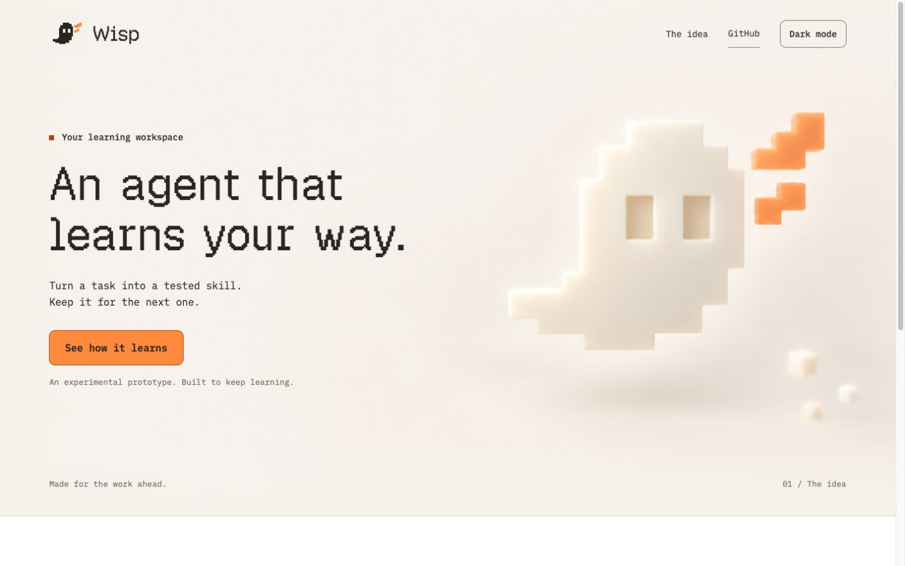
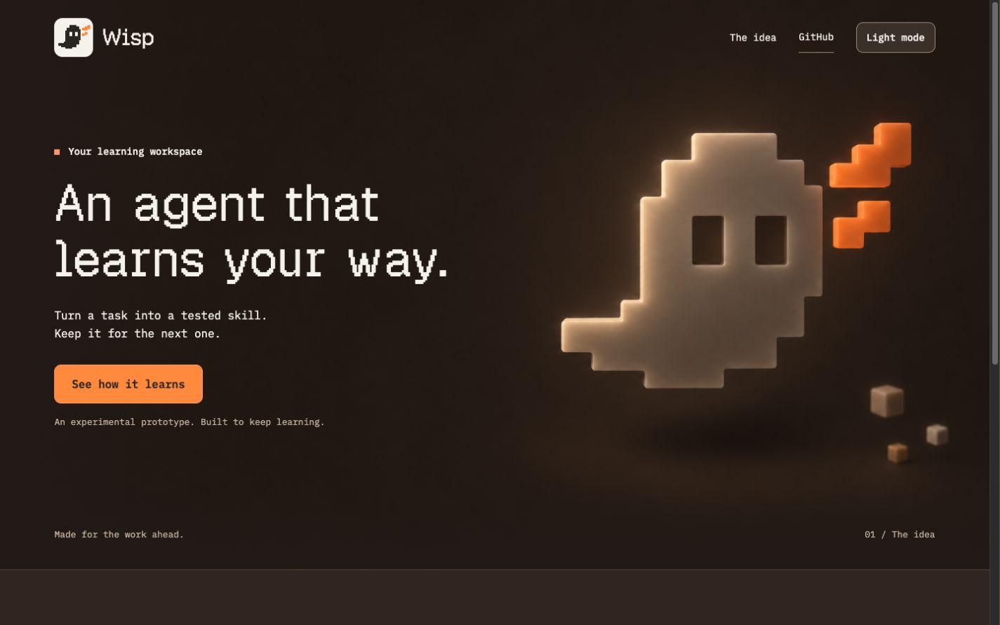

# Wisp landing page

A short English landing page for Wisp, David's experimental learning workspace. David selected the name on October 9, 2026. This page presents the idea and links to the project; it does not run the agent.

## Design source

The page uses the GitHub asset branch `codex/landing-hero-assets`, commit `17cd083`:

- `design/landing/ghost-background-light-v2.png` and `ghost-background-dark-v2.png` are the original, unchanged decorative backgrounds.
- `design/logo/pixel-ghost.svg` is the approved navigation mark.
- `output/landing-hero-study/assets/tokens.css` and its local fonts provide Geist Pixel Square 400, IBM Plex Mono, and both theme palettes. The font licenses and provenance ship with the site.

The headline is real HTML above the decorative layer. On mobile the illustration follows the text in document layout, so enlarged text cannot overlap it. Light is the default. The theme switch updates the palette and image together and saves an optional browser-local preference. The page still works when JavaScript or browser storage is unavailable.

## Build and preview

Requires Node.js 22 or later; there are no package dependencies to install.

```sh
npm run build
python3 -m http.server 4173 --directory dist
```

Edit `landing/index.html`, `landing/style.css` or `landing/theme.js`, then rebuild. The build script copies only explicitly selected public assets to `dist/`. Documentation, source files, the prototype backend and local environment files are not deployed.

## Vercel

Import `drewn-ed/007FrankensteinAgent` from GitHub, selecting branch `codex/landing-vercel`. Use the repository root as the Root Directory. The checked-in `vercel.json` selects the static configuration, `npm run build` and output directory `dist`. No environment variables or API keys are required.

The checked-in configuration is ready for Vercel. A live deployment must still be verified after the owner signs in and connects the project. The earlier ChatGPT Sites URL is a separate, older version.

## Verification — October 9, 2026

- Build and JavaScript syntax checks passed.
- Both theme backgrounds, local fonts, internal anchors and CSS asset paths resolve.
- Browser inspection covered a 1440 px desktop and 390 / 320 px mobile widths, with no horizontal overflow.
- Theme switching, persisted theme after reload, and the main section link were exercised.
- Mobile artwork follows the text rather than covering it. No console errors or warnings were observed on the final preview.
- Reduced motion is respected. This is not a full accessibility audit or validation of agent capabilities.

## Previews





[Light mobile](../output/landing-page/light-mobile.jpg) · [Dark mobile](../output/landing-page/dark-mobile.jpg)
